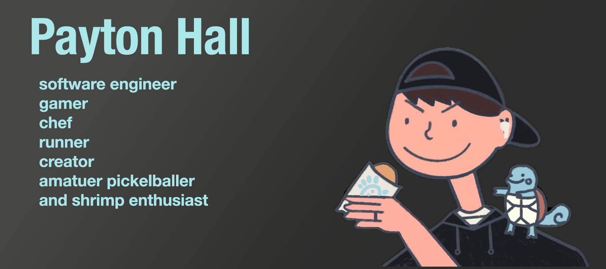

<h2> Hello, I'm Payton</h2>

[](https://www.linkedin.com/in/payton-hall-47a498125/)
[](https://github.com/Paytonjhall)
[](https://www.youtube.com/@3Gundi)
[](https://steamcommunity.com/id/paybaeslay/)
[](https://www.strava.com/athletes/179143213)
[](https://leetcode.com/u/Paytonjhall/)
[](https://music.apple.com/profile/paythall)

```html
<div align="center">
  <br/>
  <a href="https://github.com/Paytonjhall/test-css.svg">
    
  </a>
  <br/>
</div>
```


